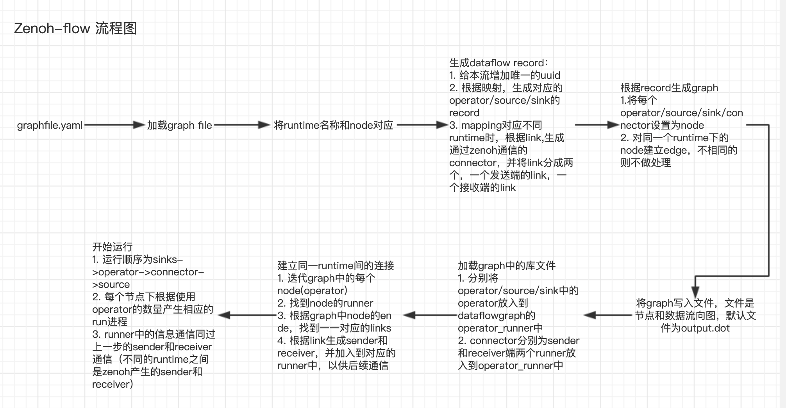
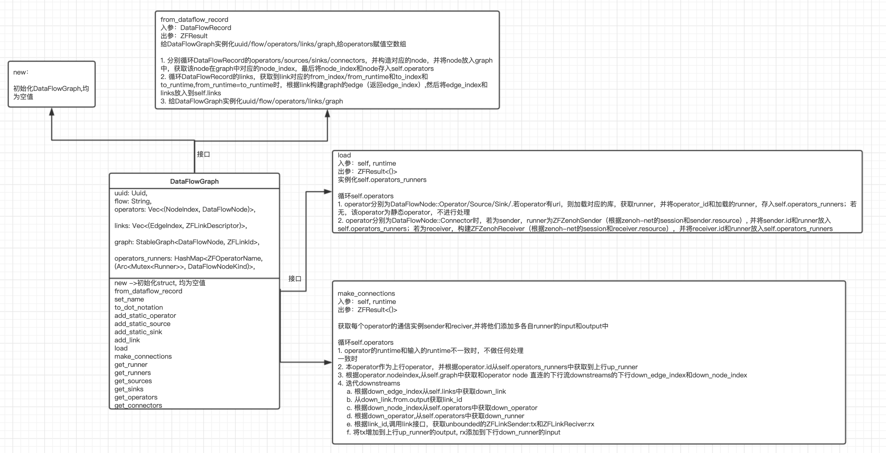
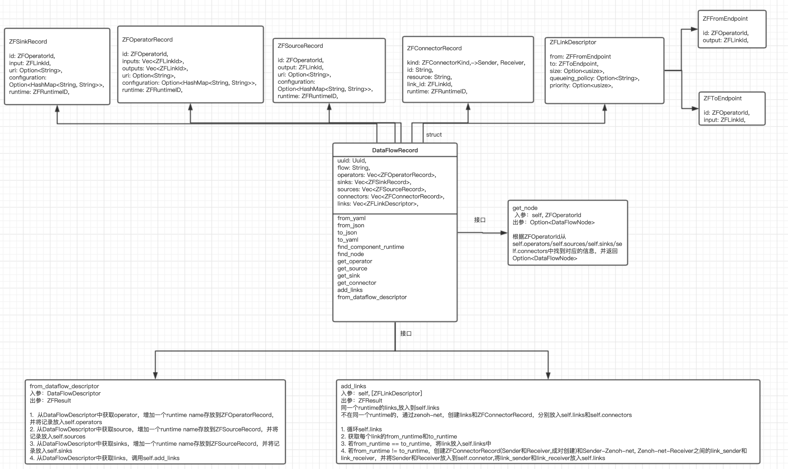
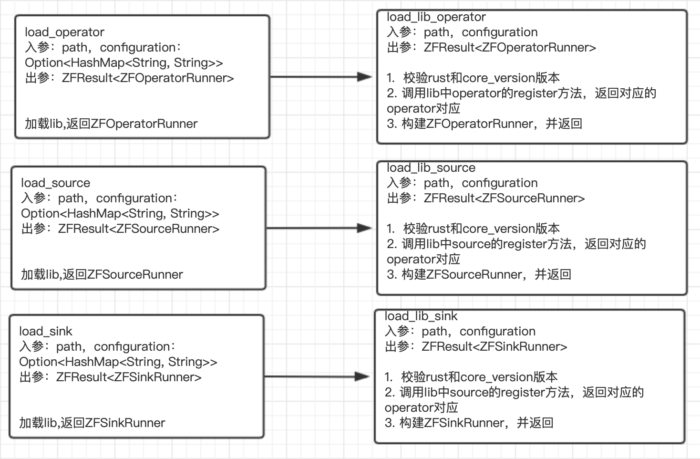
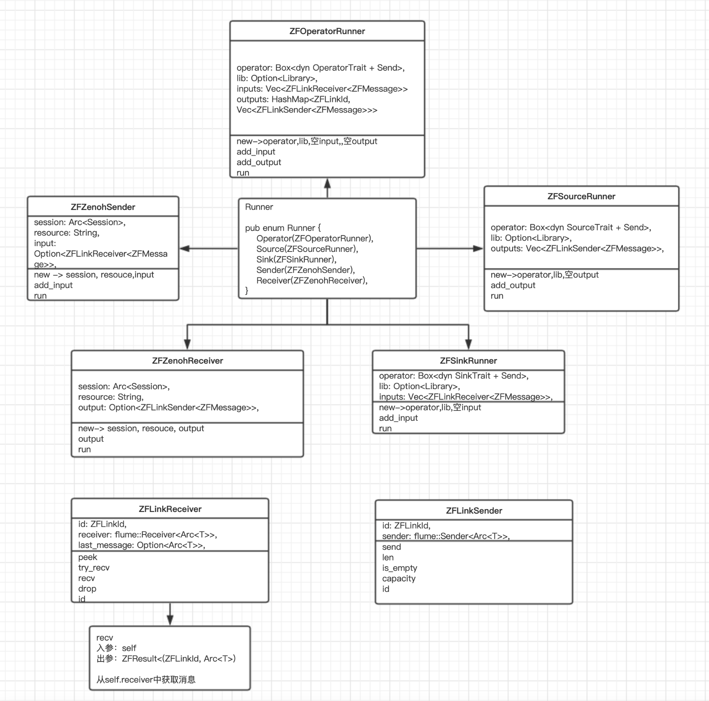
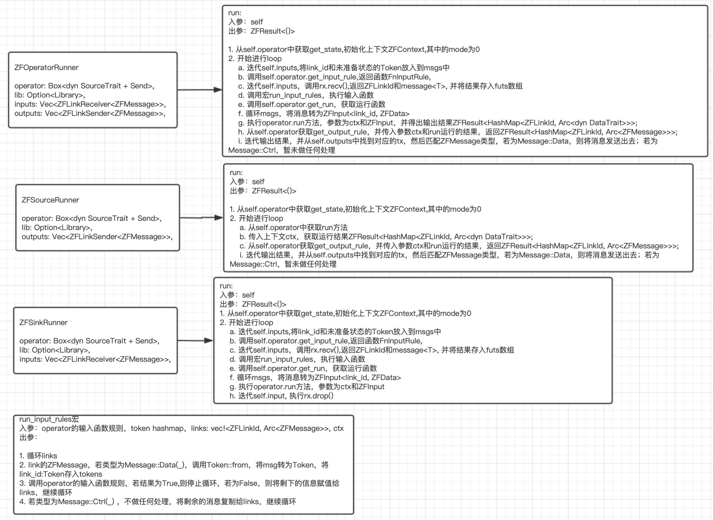
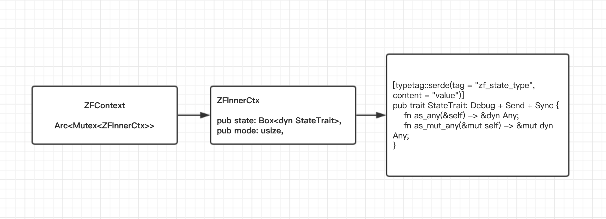
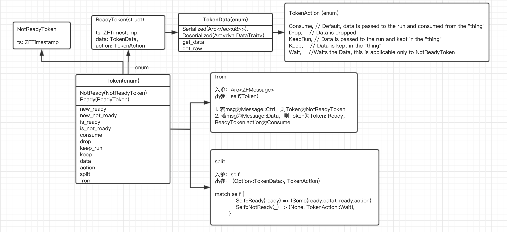
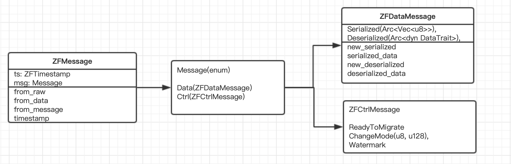
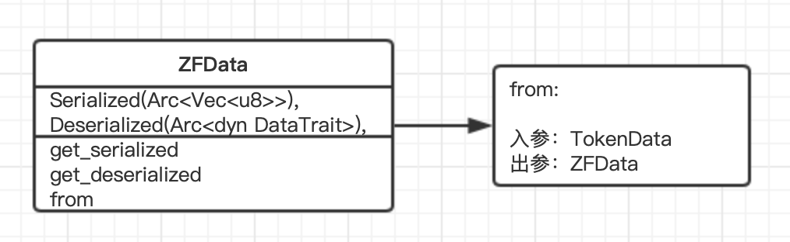

# Eclipse Zenoh-Flow Architecture

## graph file 说明

### flow

本流的唯一ID，不可重复

### operators

可有多个operator，有输入和输出，在graph中为输入输出的node

    id: operator在graph中的唯一id

    uri: operator库文件地址, 必须有对应的库文件，否则失败

    inputs: operator的输入的port id，字符串类型或字符串类型的数组均可

    outputs: operator的输出的port id，字符串类型或字符串类型的数组均可

    configuration: 配置文件，以健值对的方式存在，加载库时，读取到配置文件，并传入到operator的register中，以供本operator使用

### sources

数据源，只有输出

    id: source在graph中的唯一id

    uri: source库文件地址, 必须有对应的库文件，否则失败

    outputs: source的输出的port id，字符串类型或字符串类型的数组均可

    configuration: 配置文件，以健值对的方式存在，加载库时，读取到配置文件，并传入到source的register中，以供本operator使用

### sinks

数据输出点，只有输入

    id: sink在graph中的唯一id

    uri: sink库文件地址, 必须有对应的库文件，否则失败

    input: sink的输出的port id，字符串类型或字符串类型的数组均可

    configuration: 配置文件，以健值对的方式存在，加载库时，读取到配置文件，并传入到source的register中，以供本operator使用


### links

带有方向的连接线，数据流向通过本连接传递，每个operator/source/sink可有多条有方向的links。要求输入输出的ID一致。

from: 连接的开始一方

    id: 对应的operator/source的id

    output: operator/source输出的port id

to: 连接到达的一方

    id: 对应的operator/sink的id

    input: operator/sink输入的port id，from的output一一对应

### mapping

每个operator/source/sink对应的运行时名称，未配置时候，默认为启动时候的runtime名称

    id: operator/source/sink的id

    runtime: 运行时名称

## 关于Node和Edge

node有4种，为：operator/source/link/connector。不同的runtime的link，在建立link时，会创建connector节点，并分别创建两个link，connector两侧的link通过zenoh-net通信，通过此实现跨网络通信。

edge是根据link生成的带有方向的线条。

## 流程图




## 关于DataFlowGraph



## 关于DataFlowRecord



## 关于加载库函数



## 关于 Runner

### runner类型



### runner运行过程




## 上下文如何实例化



在ZFOperatorRunner/ZFSourceRunner/ZFSinkRunner的run方法中对ZFContext实例化
```
let ctx = ZFContext::new(self.operator.get_state(), 0);
```

实例化的上下文被传递给source/operator/sink的get_input_rule/get_run/get_output_rule中，以便运行时使用

## 数据类型

TokenData/ZFMessage和ZFData这三种数据类型是一样的结构，只是用在不同的数据处理过程

1. TokenData 是在Token中使用，通过将ZFMessage转为TokenData，在operator中的input_rule中使用

2. ZFData operator的输入函数的输出数据转为ZFData，并将其传入到operator.run

3. ZFMessage operator的输出函数的返回数据，转为ZFMessage，在sender和receiver中传输


### Token



### ZFMessage



### ZFData




## 创建graph不仅仅可以是yaml，也可以为json，或者代码直接实现各个operators